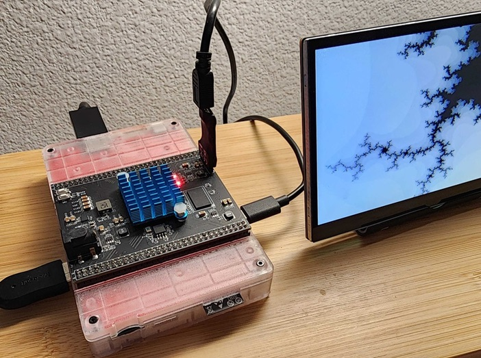

# tinysys



# What is it?

Tinysys started out as a hobby project. It now has two RISC-V cores, and several other facilities listed below, and can happily run most software with minimal tweaks.

Of course, before you ask, it does run DOOM, and with sound and keyboard input! (Lately, it has been running Quake as well.)

# System specifications

- 2x RISC-V based CPUs (architecture: rv32im_zicsr_zifencei_zfinx)
- First core runs the OS kernel and user processes
- Second core is reserved for user processes
- 166.66667MHz bus and CPU clock, semi-pipelined execution
- Supports instruction fence and data cache flush/invalidate operations
- Single precision FPU per CPU (no float control CRSs)
- Float and integer GPRs share the same register space (zfinx extension)
- 32 GRPs x 32 bits
- 4096 CSRs x 32 bits (some registers reserved for CPU and some are immutable)
- All CPUs have access to each-other's CSR register files via memory mapped addresses
- Integer multiply / divide units per CPU
- Software, hardware and timer interrupts per CSR per core
- 16Kbytes of direct mapped instruction cache (256 lines x 64 bytes)
- 32Kbytes of direct mapped data cache (512 lines x 64 bytes)
- 128 bit AXI4 bus with 32 bit address line
- Memory arbiter for on-board device system memory access (round-robin)
- Memory mapped external hardware (audio / video etc)
- HDMI 1.4b compatible video and audio output via external chip (12 bits per pixel, 16bps stereo 44/22/11KHz for audio, RGB or paletted modes)
- SDCard for file I/O
- 4 debug LEDs (also shared by OS as indicators)
- Custom preemptive multitasking OS, with file I/O and basic memory allocator via syscalls
- Optionally, a rom.bin image can be loaded from SDCard to replace the OS in ROM
- ESP32S3 on board for I/O handling (UART serial connected directly for CLI and other future connectivity, running at 460800 baud)
- Future revisions will use USB-OTG on the ESP32S3 module to allow for mass storage access to the device
- 16Kbytes mailbox memory for task scheduler + general purpose use (uncached)
- 16Kbytes of scratchpad memory for inter-processor communications or temporary data storage (uncached)
- Horizontal blanking interrupts to synchronize CPU with VPU for video effects or interrupt driven vsync page flip

# Overview of the processing units

## CPU
Based on 32 bit RISC-V ISA. Implements base integer instruction set, required cache operations (I$ and D$) and a large CSR file.
The core currently has an average instruction retirement rate of ~6 CPI (clocks per instruction) and runs at 166.667MHZ, which
is also the speed of the AXI4 bus, where all peripherals and memory reside.

### Fetch/Decode/IRQ
This unit reads an instruction at PC, decodes it and outputs it (together with its PC) to instruction output FIFO (IFIFO). If it's an interrupt entry/exit or some other special instruction (for instance I$ flush) then it is handled entirely within the fetch unit. This unit is also responsible for inserting pre/post interrupt code from an internal ROM at interrupt or exception time. Conditional branches will place fetch unit into an idle state, where it will wait for the execute unit to resolve the target branch address. This means there's no branch prediction on the CPU just yet.

### Execute/Load/Store
This unit will read an instruction from the IFIFO if available, load registers with values, execute (ALU/BLU/CSR/SYS) and decide on new branch target if there's a branch involved. After deciding on the branch address, fetch unit is notified so it can resume instruction fetches. Where possible, load or store operations will attempt to overlap with fetch and execution.

## VPU
Video processing unit. Handles scan-out of various video sizes (320x240 and 640x480) and bit depths (8bpp index color or 16bpp RGB color). It contains a scanline cache which is populated via burst reads from system memory, from which either a scan-doubled or single line is output to the display, based on video mode height. The device allows for mid-frame change of resolution via hblank interrupts.

## APU
Audio processing unit. Handles RAW audio outputs, and also manages 44/22/11KHz stereo playback and double-buffer handling of RAW audio.

# Overview of the bus

## AXI4 bus
The AXI4 bus, running at 166.667MHz, connects all of the processing units to memory or devices. In the case of memory, access is cached per perhipheral as needed. Memory mapped device access is always uncached.

# Contributors

```
Martin Hedlund

  tbm_vsnprintf() and tbm_printf() functions

Wade Brainerd

  fcvtswu4sat instruction
```

# Custom instructions

## Convert from float to 4 bit integer, saturated (FCVTSWU5SAT)

This instuction has been contributed by Wade Brainerd. It's very useful in converting floating point values to device specific 4 bit color values.

The following python script helps encode a hex representation of this instruction, for convenience:

```
op = 0b1010011		# OP-FP (floating point operation)
rd = 0b01010		# destination register - a0 in this sample (a0 == x10)
rs1 = 0b01011		# source register - a1 in this sample (a1 == x11)
funct7 = 0b1100001	# funct5 F7_FCVTSWU5SAT - this is our new sub-instruction
inst = op | (rd << 7) | (rs1 << 15) | (funct7 << 25)

print(f"{inst:x}")
```

You can then use it in code as follows:

```
inline uint32_t ftoui4sat(float value)
{
  uint32_t retval;
  asm (
    "mv a1, %1;"
    ".insn 0xc2058553;" // fcvtswu4sat a0, a1 // note A0==cpu.x10, A1==cpu.x11
    "mv %0, a0; "
    : "=r" (retval)
    : "r" (value)
    : "a0", "a1"
  );
  return retval;
}
```

P.S. For the future we might be able to do this natively on a RISC-V or propose an extension for arbitrary saturation for custom formats.

# Software

Please see [README.md](./software/README.md) for details on software samples, ROM and prerequisites for building ELF files.
