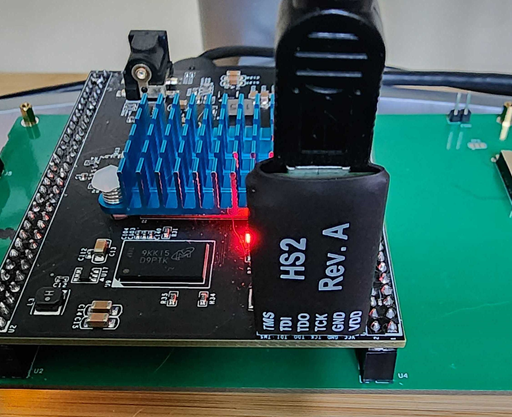

# Latest Gateware Build is: 00203
# Latest OS ROM version is: 00152
# Latest ESP32 ROM is: r1.1H
# Latest Board version is: 2H

# Gateware binary
The gateware binary contains latest version of the device.
There is no need for a ROM file. 
If you have an older one, you can simply delete it, or use a `rom.bin` file with this version or higher.

# Current device architecture
This is the current architecture to use with gcc13 and higher: `rv32im_zicsr_zifencei_zfinx`

# ROM history
r1.01: Initial release version 
r1.03: Improvements for dual core boot stability, fixed audio hardware playback rate issue 
r1.06: Minor improvements to inner ROM loop and some other bug fixes 
r1.07: DMA hardware change in preparation for misaligned DMA support 
r1.08: Stability fixes 
r1.09: Added misaligned DMA support and removed ESP32/FPGA GPIO bridge device (to be re-done later), also added hblank interrupt mechanism and remote reboot ability (~ character over UART) 
r1.0A: Added 64Kbytes of scratchpad RAM, shared across all cores, WNS relaxed to leave room for any future bug fixes 
r1.0B: Minor device cleanup, reduced scratchpad to 16Kbytes, bumped mailbox to 16Kbytes 
r1.0C: Added a third CPU, CLI improvement to ROM and other minor fixes 
r1.1D: Improvements to reboot / task system and more ROM code cleanup, also updated file upload routines 
r1.1E: Updated UART to run at 460800 
r1.1F: Completely switched to ESP32S3 and new board(2G), added reset lines to UART, some helper tool and CLI improvements 
r1.1H: Removed DMA hardware due to complications, added experimental HDMI output for video/audio 
r1.3H: Some timing fixes and ROM code cleanup 
r1.4H: Slightly better timing, some hblank SDK and hardware work done (still not stable enough due to IRQ handling mechanism) 
r1.5H: Reduced I$ turnaround by one clock on cache hit 
r1.8F: Removed hblank device, updated ROM with fixes to task logic 
r1.9A: ROM updates with OS side input handling, software updates to match 
r1.9B: Minor changes to ROM and SDK routines, updates samples 
r2.0A: Added vectored interrupt support and bumped clock to 175MHz 
00201: Changed gateware versioning scheme, changed reset logic to full FPGA reset (clock and all clocked devices) 
00202: Task stack sizes bumped to 16K from 1K, watermark register now does not survive hard reset (only soft reset) 
00203: Bumped scratchpad to 64K, reset is more robust, updated ROM image with some memory fixes 
00151: OS updates for task errors 
00203: OS changes to same device version 
00152: OS changes (mainly for ELF loaded memory stomp) 
00203: Fixed float->uint conversion bug, keeping hardware version same 

# Device gateware

This folder contains the gateware that will reprogram the FPGA board on tinysys to a functioning RISC-V CPU with several other peripherals.

The intended device is the QMTECH A7200T core board, which is a blank FPGA board with nothing but an XCA7200T AMD/Xilinx part and a 256Mbytes DDR3 memory. The firmare also needs at least a revision 2E tinysys board to be attached to it to provide USB serial / HID / audio and video connections as well as the sdcard port.

Programmin the gateware onto the device requires a JTAG adapter (such as the HS2 REVA from Digilent or a Xilinx compatible 6-pin adapter), a PC, and Vivado 2024.1 installed.

NOTE: Make sure to never attempt this unless absolutely necessary and a hardware bug needs addressing / fixing or a new feature is added to the device!

# Programming

First we need to attach the JTAG adapter to the PC, and make sure the Vivado drivers are installed for it.

For this step, attach a USB cable to the HS2(revA or later), attach one end to your PC, then attach the adapter end to the 6 pin connector on the already powered-up FPGA board, as seen below:

When properly connected, the text on the HS2 should be facing away from the board (easiest way to make sure it's correct is to find the GND marker on the 6 pin connector on the FPGA board, and line up the GND marker on the HS2 to that)

Start Vivado 2024.1 (or newer version) and on the first page, select Open Hardware Manager.
You should then see a note that says 'No hardware target is open.' Click the `Open Target` button next to it and select the `Auto Connect` option.

This should bring up a view which shows a 'xc7a200t' device listed. Right click on it and select `Add Configuration Memory Device`
In the search box, type `is25lp128f-spi-x1_x2_x4` and accept the changes.

Now this memory device should be listed unde the xc7a200t device, most likely below a XADC device.

Right click on the is25 and select `Program Memory Configuration Device`, then browse to and select the `tophat.bin` file in the gateware folder for the Configuration File.

Click OK and wait until the device is programmed (which will take a minute or so)

Once the progamming is complete, the device will not function until it's reset. Press the program/reset button (the small white button closer to the power connector barrel) and the device will reboot itself with the new gateware.

NOTE: the ROM image used by an updated gateware may differ from the one on the sdcard, make sure to either delete the one on sdcard or update it to a version newer or same as the gateware one, to ensure correct operation.
